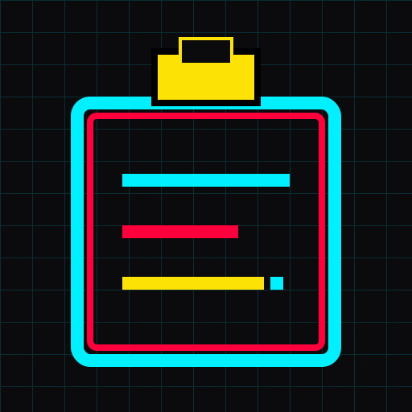

# Cyber-Clip (赛博剪贴板)

<div align="center">
  
</div>

<p align="center">
  A retro-futuristic, cyberpunk-themed web clipboard for securely sharing text and images across devices.<br>
  一个复古未来主义、赛博朋克风格的跨设备网页剪贴板，支持安全地分享文本与图片。
</p>

---

## 📖 English Introduction

**Cyber-Clip** is a lightweight, zero-database web application built with Node.js and Express. It allows you to quickly share text snippets or images across different devices (e.g., from your PC to your phone) without the hassle of logging in or installing native apps. 

It features a hardcore **8-bit pixel art & CRT monitor aesthetic**, designed for developers and cyberpunk enthusiasts.

### ✨ Features
*   **Text & Image Support:** Paste text or intercept `Ctrl+V` image pasting directly on the web page.
*   **Burn After Reading:** Data automatically self-destructs after **3 visits** or **8 hours** of inactivity. Images are physically deleted from the server.
*   **Zero Database:** Pure in-memory (`Map`) storage and local file system. Fast and incredibly lightweight.
*   **QR Code Extraction:** Generates a stylized QR code for instant mobile access.
*   **Retro UI:** Pure CSS CRT scanline effects, neon colors, and the classic `Press Start 2P` arcade font.

### 🚀 Deployment Guide

#### Prerequisites
*   [Node.js](https://nodejs.org/) (v16 or higher)
*   [PM2](https://pm2.keymetrics.io/) (Optional, for production)

#### Local Development
1. Clone the repository:
   ```bash
   git clone https://github.com/your-username/cyber-clip.git
   cd cyber-clip
   ```
2. Install dependencies:
   ```bash
   npm install
   ```
3. Start the server:
   ```bash
   node server.js
   # The server will run on http://localhost:3001
   ```

#### Production Deployment (Using PM2)
We recommend using PM2 to keep the application running in the background.
```bash
# Start the app
npm start

# Other PM2 commands
npm run stop     # Stop the app
npm run restart  # Restart the app
npm run logs     # View live logs
```

### 🔒 Security Recommendation
Since this application lacks a complex user system, if you plan to expose it to the public internet, it is **highly recommended** to protect it using zero-trust tunnels like **Cloudflare Tunnels** or **Tailscale**, or by adding HTTP Basic Auth to prevent unauthorized access and abuse.

---

## 📖 中文介绍

**Cyber-Clip** 是一个基于 Node.js 和 Express 构建的轻量级、无数据库网页剪贴板。它能让你在不同设备间（例如电脑到手机）快速分享文本片段或图片，而无需登录或安装任何原生 App。

它拥有硬核的 **8-bit 像素艺术与 CRT 显示器美学** 界面，专为开发者与赛博朋克爱好者设计。

### ✨ 核心特性
*   **文本与图片双支持：** 支持直接输入文本，或在网页上使用 `Ctrl+V` 拦截并粘贴图片。
*   **阅后即焚：** 数据在被访问 **3 次** 或 **8 小时** 未活动后会自动销毁。图片文件会从服务器磁盘彻底物理删除。
*   **零数据库：** 纯内存 (`Map`) 与本地文件系统存储，极速且极其轻量。
*   **二维码提取：** 自动生成风格化的二维码，手机扫码即可直接提取。
*   **复古终端 UI：** 纯 CSS 实现的 CRT 屏幕扫描线特效、霓虹色彩以及经典的 `Press Start 2P` 街机字体。

### 🚀 部署指南

#### 环境要求
*   [Node.js](https://nodejs.org/) (v16 或更高版本)
*   [PM2](https://pm2.keymetrics.io/) (可选，用于生产环境守护进程)

#### 本地开发
1. 克隆仓库：
   ```bash
   git clone https://github.com/your-username/cyber-clip.git
   cd cyber-clip
   ```
2. 安装依赖：
   ```bash
   npm install
   ```
3. 启动服务器：
   ```bash
   node server.js
   # 服务器将运行在 http://localhost:3001
   ```

#### 生产环境部署 (使用 PM2)
推荐使用 PM2 来让应用在后台持久运行。
```bash
# 启动应用
npm start

# 其他 PM2 快捷命令
npm run stop     # 停止应用
npm run restart  # 重启应用
npm run logs     # 查看实时日志
```

### 🔒 安全建议
由于本项目追求极简，并未包含复杂的用户鉴权系统。如果您打算将其暴露在公网，**强烈建议** 搭配 **Cloudflare Tunnels**、**Tailscale** 等零信任内网穿透工具使用，或在代码层添加 HTTP Basic Auth 基础认证，以防止接口被滥用。

---
<p align="center">
  <i>Developed with ❤️ by s1nc3ju1y</i>
</p>